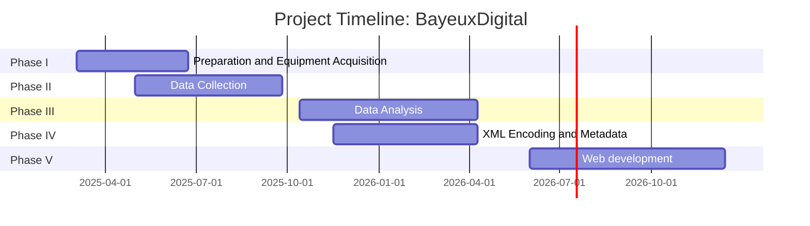

### Gantt-Timeline-Chart: BayeuxDigital

### Project Phases and Tasks

1. [Phase I: Preparation and Equipment Acquisition](https://github.com/bjorkk/BayeuxDigital/issues/8) - Assigned to Diana Korol, Philipp Moser, Bjoerk Kosir
2. [Phase II: Data Collection](https://github.com/bjorkk/BayeuxDigital/issues/9) - Assigned to Philipp Moser, Bjoerk Kosir
3. [Phase III: Data Analysis](https://github.com/bjorkk/BayeuxDigital/issues/10) - Assigned to Diana Korol, Philipp Moser, Bjoerk Kosir
4. [Phase IV: XML Encoding and Metadata](https://github.com/bjorkk/BayeuxDigital/issues/3) - Assigned to Philipp Moser, Bjoerk Kosir
5. [Phase V: Web Development](https://github.com/bjorkk/BayeuxDigital/issues/11) - Assigned to Diana Korol, Philipp Moser, Bjoerk Kosir
